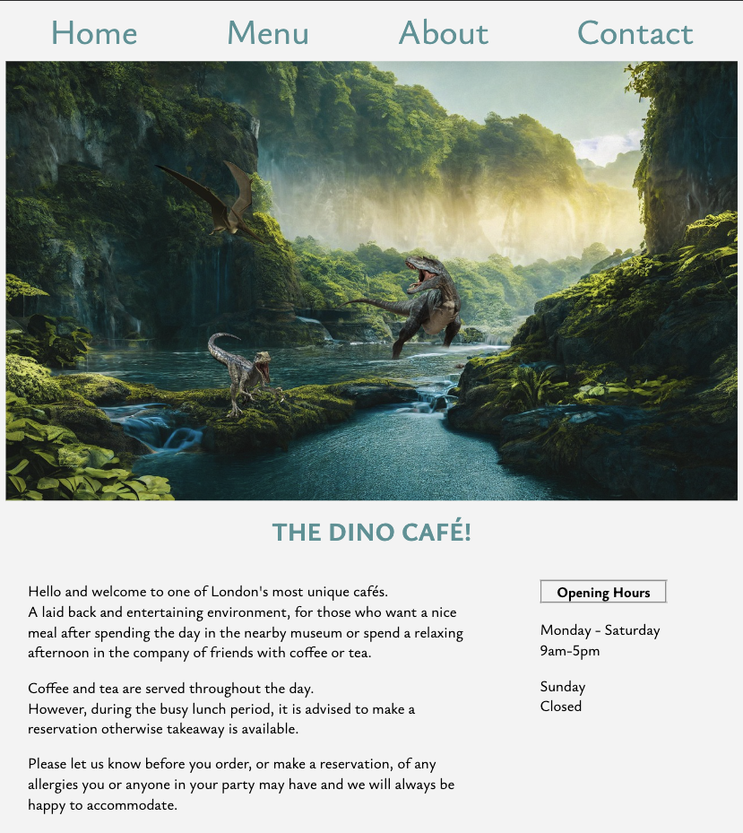

# Dino-Cafe

## Description

My second project.

This was created with HTML, CSS and Javascript using VSCode.  
The aim was to build a website for a fictional cafe and help promote it. In this case, a dinosaur themed cafe, inspired by my children's love for them.  

The website has a simple navigation bar with four links: Home, Menu, About and Contact.

The Home page has a brief welcome message and openeing times for the cafe.  
Menu has a list of the items for sale along with the prices and an automatic slideshow for each section within the menu.  
About is a brief explanation into the cafe and it's aim with another automatic slideshow.  
Contact contains a small paragraph explaining what to do in order to get in contact
with the cafe. A hyperlink which opens up a new message in the users mail app and telephone number.

The biggest challenge for me was implementing the automatic slideshow for the menu page. Hope in the future to add more functionality to the site by means of a cart function, for example.

## Getting Started

From the navigation bar the top of the page, you can navigate through the various pages on the site. The homepage has a welcome message below the image, as well as the opening hours.
  

The menu page has six different sections with two items for sale in each along with their prices. Each section has, therefore, an image of each item alternating in an automatic slideshow.
   

The about page briefly describes the nature of the business. The text is centered below an automatic slideshow of three dinosaur related images.

The contact page has been kept simple. There is an image with text on top of it explaining how to contact the cafe and an email hyperlink that opens a new message in the users email client.

### Dependencies

* No particular prerequisites required to open this project.
* Open with MacOS, Windows, IOS and Android.

### Testing

Every page was run through the official W3C validator and results are as follows:

* Home page
Couple of mistakes straight away that were corrected for all other pages as well.
HTML lang attribute was not set and i had forgotten to include the title element.
Also, charset did not require the / at the end of it so this was removed.

* Menu page

* About page

* Contact page

## Acknowledgments

Inspiration and thank you to the following:

[Template](https://gist.github.com/DomPizzie/7a5ff55ffa9081f2de27c315f5018afc) for this Readme.

[Colours](https://htmlcolorcodes.com/) for the portfolio chosen.

[Basics](https://www.learningpeople.com/uk/) for creating this portfolio.