# Dino-Cafe

## `Description`

My second project.

This was created with HTML, CSS and Javascript using VSCode.  
The aim was to build a website for a fictional cafe and help promote it. In this case, a dinosaur themed cafe, inspired by my children's love for them.  

The website has a simple navigation bar with four links: Home, Menu, About and Contact.

The Home page has a brief welcome message and openeing times for the cafe.  
Menu has a list of the items for sale along with the prices and an automatic slideshow for each section within the menu.  
About is a brief explanation into the cafe and it's aim with another automatic slideshow.  
Contact contains a small paragraph explaining what to do in order to get in contact
with the cafe. A hyperlink which opens up a new message in the users mail app and telephone number.

The biggest challenge for me was implementing the automatic slideshow for the menu page. Hope in the future to add more functionality to the site by means of a cart function, for example.

## `Getting Started`

From the navigation bar the top of the page, you can navigate through the various pages on the site. The homepage has a welcome message below the image, as well as the opening hours.
  

The menu page has six different sections with two items for sale in each along with their prices. Each section has, therefore, an image of each item alternating in an automatic slideshow.
   

The about page briefly describes the nature of the business. The text is centered below an automatic slideshow of three dinosaur related images.

The contact page has been kept simple. There is an image with text on top of it explaining how to contact the cafe and an email hyperlink that opens a new message in the users email client.

### `Dependencies`
***

* No particular prerequisites required to open this project.
* Open with MacOS, Windows, IOS and Android.

### `Testing`
***

#### *HTML validation*  

Every page was run through the official W3C validator and results are as follows:

* Home page

Couple of mistakes straight away that were corrected for all other pages as well.
HTML lang attribute was not set and I had forgotten to include the title element.
Charset did not require the / at the end of it so this was removed.
Also, the start tag head error was due to the charset and style link being outside of the the head element. 
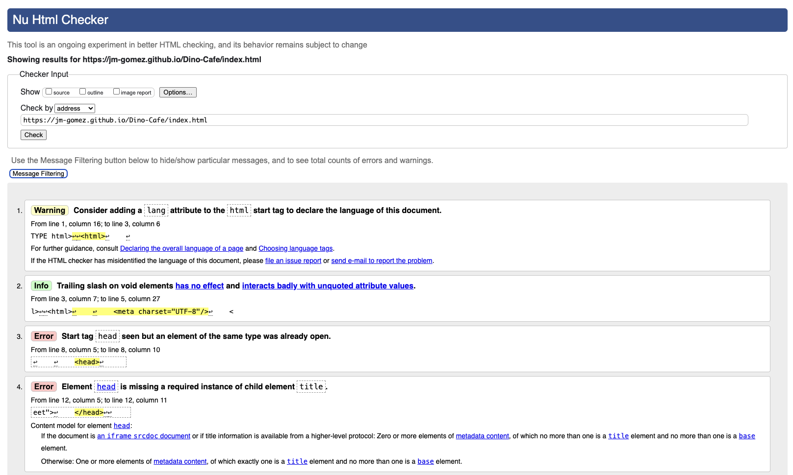

All issues corrected, no errors after that.
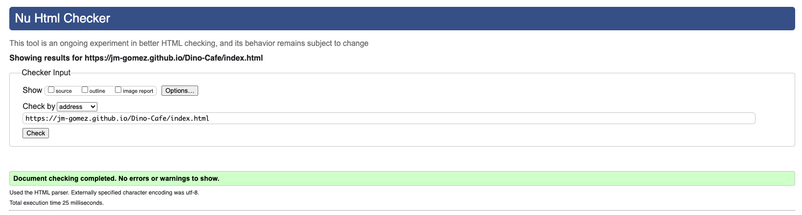

* Menu page

Minor mistake with forward slash used in the line break tags < br>.
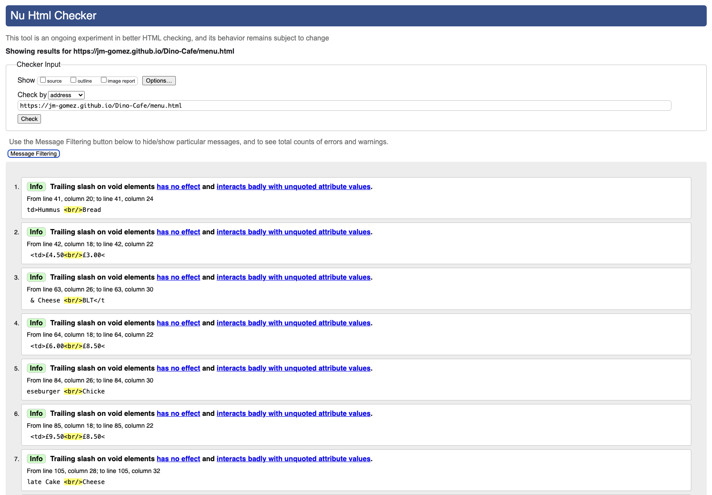

No issues after they were removed.
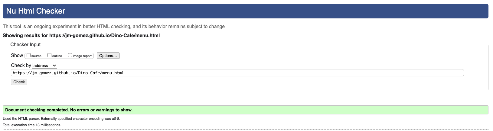

* About page

No issues with the about page.
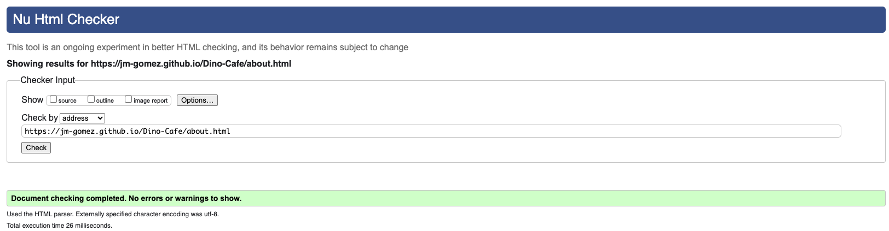

* Contact page

No issues with the contact page.
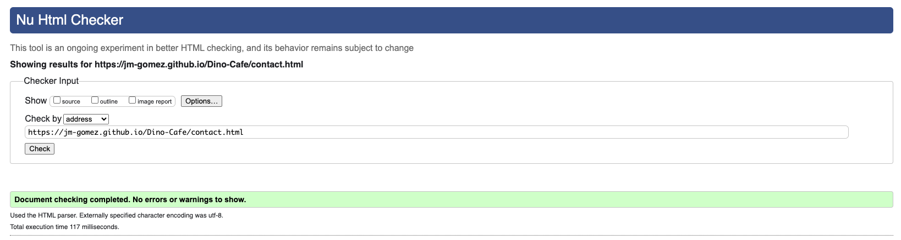

#### *CSS validation*  
The CSS page was run through the W3C CSS validator and returned no errors.
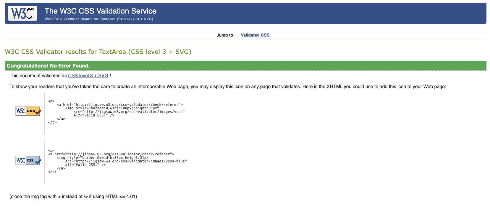

#### *Javascript validation* 
Main.js and about.js were run through jshint.com and the following errors were revealed.  
Main.js had a couple of missing and unnecessary semicolons.    
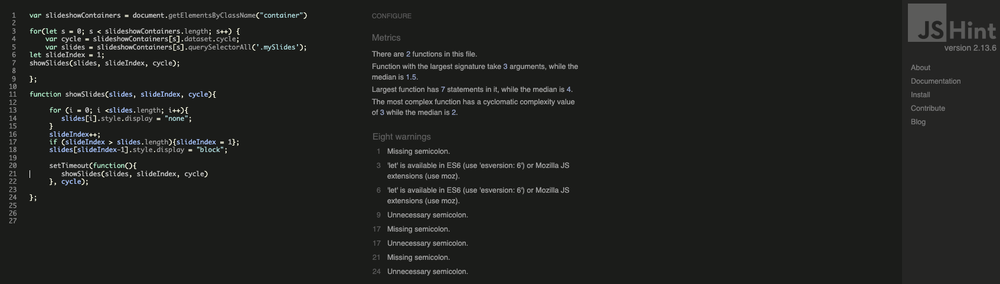

About.js had a missing semicolon and several warnings regarding 'let' being available in ES6.
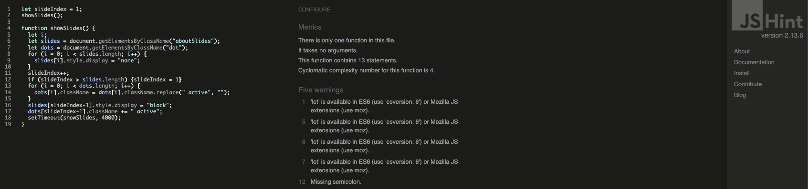

/*jshint esversion: 6 */ was added to the top of both js files and it eliminated the warning regarding 'let' available in ES6.
No warnings with the code after that on either file.
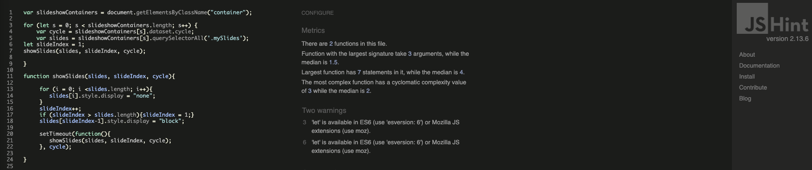

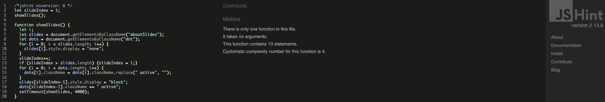

## `Acknowledgments and Sources`

Inspiration and thank you to the following:

[Template](https://gist.github.com/DomPizzie/7a5ff55ffa9081f2de27c315f5018afc) for this Readme.

[Colours](https://htmlcolorcodes.com/) for the colour scheme chosen.

[Basics](https://www.learningpeople.com/uk/) for creating this project.

[W3Schools](https://www.w3schools.com/howto/howto_js_slideshow.asp) help with creating the slideshows.

[email link](https://www.tutorialspoint.com/html/html_email_links.htm) creating the email link on the contact page.